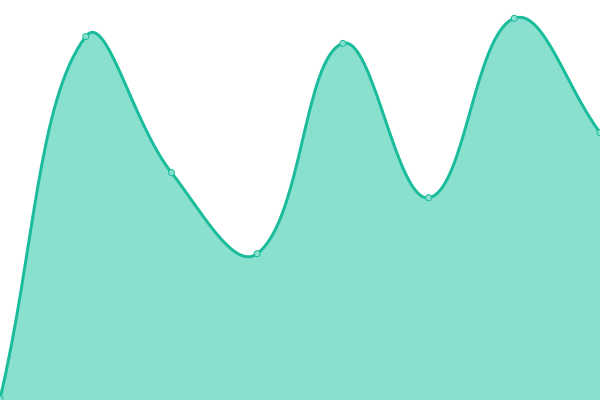

# [📈 Live Status](https://demo.upptime.js.org): <!--live status--> **🟩 All systems operational**

This repository contains the open-source uptime monitor and status page for [Upptime](https://upptime.js.org), powered by [Upptime](https://github.com/upptime/upptime).

With [Upptime](https://upptime.js.org), you can get your own unlimited and free uptime monitor and status page, powered entirely by a GitHub repository. We use [Issues](https://github.com/upptime/upptime/issues) as incident reports, [Actions](https://github.com/qover-me/upptime/actions) as uptime monitors, and [Pages](https://demo.upptime.js.org) for the status page.

<!--start: status pages-->
<!-- This summary is generated by Upptime (https://github.com/upptime/upptime) -->
<!-- Do not edit this manually, your changes will be overwritten -->
<!-- prettier-ignore -->
| URL | Status | History | Response Time | Uptime |
| --- | ------ | ------- | ------------- | ------ |
|  [Qover website](https://www.qover.com) | 🟩 Up | [qover-website.yml](https://github.com/qover-me/upptime/commits/HEAD/history/qover-website.yml) | 

 224ms
     
 | 

<a href="https://status.qover.com/history/qover-website">100.00%</a>
    

|  Bike insurance API | 🟩 Up | [bike-insurance-api.yml](https://github.com/qover-me/upptime/commits/HEAD/history/bike-insurance-api.yml) | 

 341ms
     
 | 

<a href="https://status.qover.com/history/bike-insurance-api">100.00%</a>
    

|  Motor insurance API | 🟩 Up | [motor-insurance-api.yml](https://github.com/qover-me/upptime/commits/HEAD/history/motor-insurance-api.yml) | 

 110ms
     
 | 

<a href="https://status.qover.com/history/motor-insurance-api">100.00%</a>
    

|  Claims API | 🟩 Up | [claims-api.yml](https://github.com/qover-me/upptime/commits/HEAD/history/claims-api.yml) | 

 112ms
     
 | 

<a href="https://status.qover.com/history/claims-api">100.00%</a>
    

|  Home insurance API | 🟩 Up | [home-insurance-api.yml](https://github.com/qover-me/upptime/commits/HEAD/history/home-insurance-api.yml) | 

 110ms
     
 | 

<a href="https://status.qover.com/history/home-insurance-api">100.00%</a>
    

|  Policy API | 🟩 Up | [policy-api.yml](https://github.com/qover-me/upptime/commits/HEAD/history/policy-api.yml) | 

 110ms
     
 | 

<a href="https://status.qover.com/history/policy-api">100.00%</a>
    

<!--end: status pages-->

[**Visit our status website →**](https://demo.upptime.js.org)

## 📄 License

- Powered by: [Upptime](https://github.com/upptime/upptime)
- Code: [MIT](./LICENSE) © [Upptime](https://upptime.js.org)
- Data in the `./history` directory: [Open Database License](https://opendatacommons.org/licenses/odbl/1-0/)
